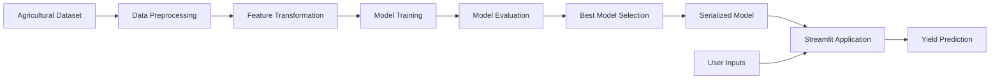

# AgroPredict AI

AgroPredict AI is a machine learning-based crop yield prediction system designed to estimate agricultural production using environmental and farming-related factors.

The application helps users analyze how variables such as rainfall, temperature, pesticide usage, crop type, and cultivation area influence crop yield. The system provides real-time predictions through an interactive Streamlit interface.

---

## Business Problem

Agricultural productivity is influenced by multiple environmental and operational factors.

Farmers and agricultural planners often face challenges such as:

* Uncertainty in crop production estimates
* Weather-related risks
* Resource allocation decisions
* Yield planning and forecasting

Accurate yield prediction can help improve agricultural planning, optimize resource utilization, and support data-driven decision making.

---

## Project Goal

Develop a machine learning solution capable of predicting crop yield using historical agricultural and environmental data.

The system enables users to input farming parameters and receive estimated crop yield predictions in real time.

---

## Solution Overview

The application uses a supervised machine learning pipeline that processes agricultural data, trains multiple regression models, evaluates their performance, and provides predictions through a web-based interface.

The workflow includes:

1. Data preprocessing
2. Feature engineering
3. Model training
4. Model evaluation
5. Prediction generation
6. User interaction through Streamlit

---

# Architecture



---

## End-to-End Workflow

### Data Processing

1. Agricultural data is collected and cleaned.
2. Missing values and inconsistencies are handled.
3. Numerical features are standardized.
4. Categorical variables are encoded.

### Model Development

1. Multiple regression algorithms are trained.
2. Models are evaluated using standard regression metrics.
3. The best-performing model is selected.
4. Trained models are serialized for deployment.

### Prediction Workflow

1. User enters agricultural parameters.
2. Inputs pass through the preprocessing pipeline.
3. The trained model generates yield predictions.
4. Predicted crop yield is displayed through the web interface.

---

## Key Features

### Crop Yield Prediction

Predicts agricultural output using environmental and farming-related variables.

### Interactive User Interface

Provides a Streamlit-based application for real-time predictions.

### Automated Data Preprocessing

Uses preprocessing pipelines for handling numerical and categorical data.

### Multiple Model Evaluation

Compares several regression algorithms to identify the best-performing model.

### Reusable Machine Learning Pipeline

Implements modular preprocessing and model training workflows using Scikit-learn pipelines.

### Model Persistence

Stores trained models using Pickle for deployment and inference.

---

## Input Parameters

The system accepts:

* Year
* Average Rainfall
* Average Temperature
* Pesticide Usage
* Cultivation Area
* Crop Type

---

## Example Prediction

### User Input

```text
Year: 2024
Rainfall: 850 mm
Temperature: 28°C
Pesticide Usage: 120 kg
Area: 150 hectares
Crop: Wheat
```

### Output

```text
Predicted Crop Yield: 5.82 tons/hectare
```

---

## Machine Learning Models Evaluated

The project evaluates multiple regression algorithms:

* Linear Regression
* Ridge Regression
* Lasso Regression
* Decision Tree Regressor
* K-Nearest Neighbors (KNN)

Model performance is compared using regression evaluation metrics before selecting the final model.

---

## Data Preprocessing

### Numerical Features

Processed using:

* StandardScaler

### Categorical Features

Processed using:

* OneHotEncoder

### Pipeline Components

Implemented using:

* ColumnTransformer
* Scikit-learn Pipelines

---

## Project Structure

```text
AgroPredict-AI/

├── data/
│
├── notebooks/
│
├── models/
│
├── src/
│   ├── preprocessing/
│   ├── training/
│   └── prediction/
│
├── app.py
├── requirements.txt
├── README.md
└── .gitignore
```

---

## Technology Stack

### Programming Language

* Python

### Machine Learning

* Scikit-Learn

### Data Processing

* Pandas
* NumPy

### Web Application

* Streamlit

### Model Persistence

* Pickle

### Version Control

* Git
* GitHub

---

## Technical Concepts Demonstrated

* Regression Modeling
* Machine Learning Pipelines
* Feature Engineering
* Data Preprocessing
* Model Evaluation
* Hyperparameter Tuning
* Streamlit Deployment
* End-to-End ML Workflow
* Real-Time Prediction Systems

---

## Evaluation Metrics

Model performance was evaluated using:

* Mean Absolute Error (MAE)
* Mean Squared Error (MSE)
* Root Mean Squared Error (RMSE)
* R² Score

---

## Getting Started

### Clone Repository

```bash
git clone https://github.com/<your-username>/AgroPredict-AI.git
cd AgroPredict-AI
```

### Create Virtual Environment

```bash
python -m venv .venv
```

### Install Dependencies

```bash
pip install -r requirements.txt
```

### Run Application

```bash
streamlit run app.py
```

### Open Application

```text
http://localhost:8501
```

---

## Use Cases

* Crop Yield Forecasting
* Agricultural Planning
* Farm Management
* Resource Optimization
* Agricultural Research
* Data-Driven Farming Decisions

```
```
